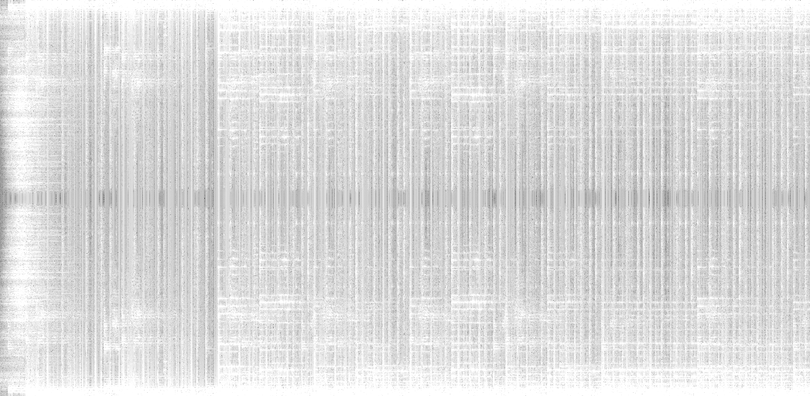
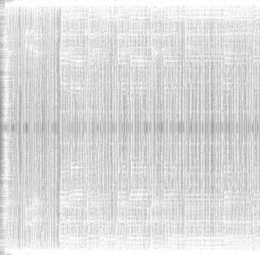

# wavecarve

Seam carving, but for audio.

# This is a work in progress!

Before carving:

After carving:

## The next step is to be able to convert the spectrogram back into audio and check what it sounds like.

Build with `go build -mod=vendor`.
