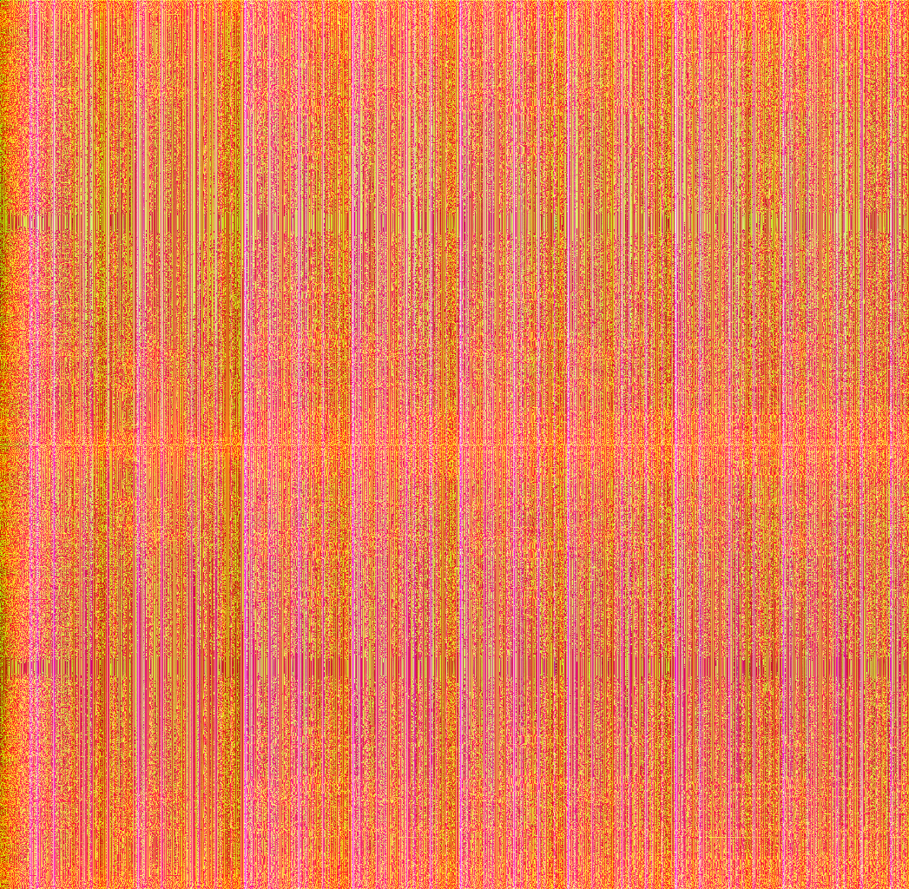
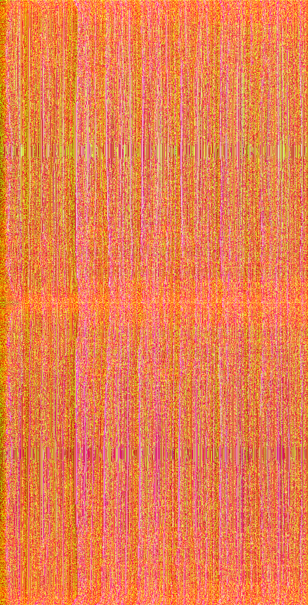

# Seam carving audio

### Here's the idea

What if audio could be converted to an image, and then seam carving could be used on the image, and then the image could be converted back to audio. Would it sound interesting? Would it be useful somehow as a sound design tool?

### TL;DR

It didn't quite work out.

### Process

With some string, glue, experience with Go and some output from GPT4, I created the `wavecarve` package for Go. This package provides these functions:

* A function for reading a `.wav` file: `ReadWavFile(filePath string) ([]int16, WAVHeader, error)`
* A function for creating and writing to a `.wav` file: `WriteWavFile(filePath string, int16s []int16, header WAVHeader)`
* A function for converting audio to an image (more or less, the conversion is a bit lossy, unfortunately): `CreateSpectrogramFromAudio(int16s []int16) (*image.RGBA, error)`
* A function for removing the least interesting parts of the image, using the excellent [github.com/esimov/caire](https://github.com/esimov/caire) package: `CarveSeams(img *image.RGBA, newWidthInPercentage float64) (*image.RGBA, error)`
* And finally, a function for converting the image back to audio: `CreateAudioFromSpectrogram(img *image.RGBA) ([]int16, error)`

These functions are used by the utilities that are included in the `cmd` directory, which are:

* `cmd/spectrogram` - a utility that reads `input.wav`, creates a visual representation of the audio (a spectrogram with phase information) and outputs the image to `spectrogram.png`.
* `cmd/recreate` - a utility that reads `input.wav`, creates a visual representation of the audio, uses this representation to try to re-create the audio (a lossy process), and outputs `output.wav`.
* `cmd/carve` - a utility that reads `input.wav`, creates a visual representation, seams carves the image to remove the least interesting parts, writes this image to `carved.png` and then creates audio from the image and outputs `output.wav`.

Note that the generated `.wav` files are unesessarily large with a little bit of audio at the start and a lot of silence at the end and needs to be trimmed down manually after having being generated. This might be fixed in a future version.

### Results

Here is the example audio I used as an input file:

https://github.com/xyproto/wavecarve/raw/main/wav/example.wav

Here is a spectrogram created with `cmd/spectrogram`:

Here is a seam carved version of the spectrogram, reduced to 50% of the width:

And here is the re-created audio from `example.wav`, created with `cmd/recreate` and then converted to `.mp3`. The audio has lost quite a bit of quality in the process and is not particularly pleasing to listen to:

https://github.com/xyproto/wavecarve/raw/main/mp3/output.mp3

If the carved image is used to re-create audio instead, this is the result:

https://github.com/xyproto/wavecarve/raw/main/mp3/carved.mp3

Even though the audio is of low quality, one can get a hint of which effect seam carving has on audio. It's not particularly pleasing.

### Conclusions

* A spectrogram + phase information is not a great representation of audio, since converting audio to this format and back is a very lossy process.
* Seam carving does not produce a particularly interesting effect on the audio, using these types of spectrograms.
* There might be other visual representations of audio that gives much better results, though.
* It's not a great sound design tool, unless a lot of filters are applied afterwards, perhaps.
