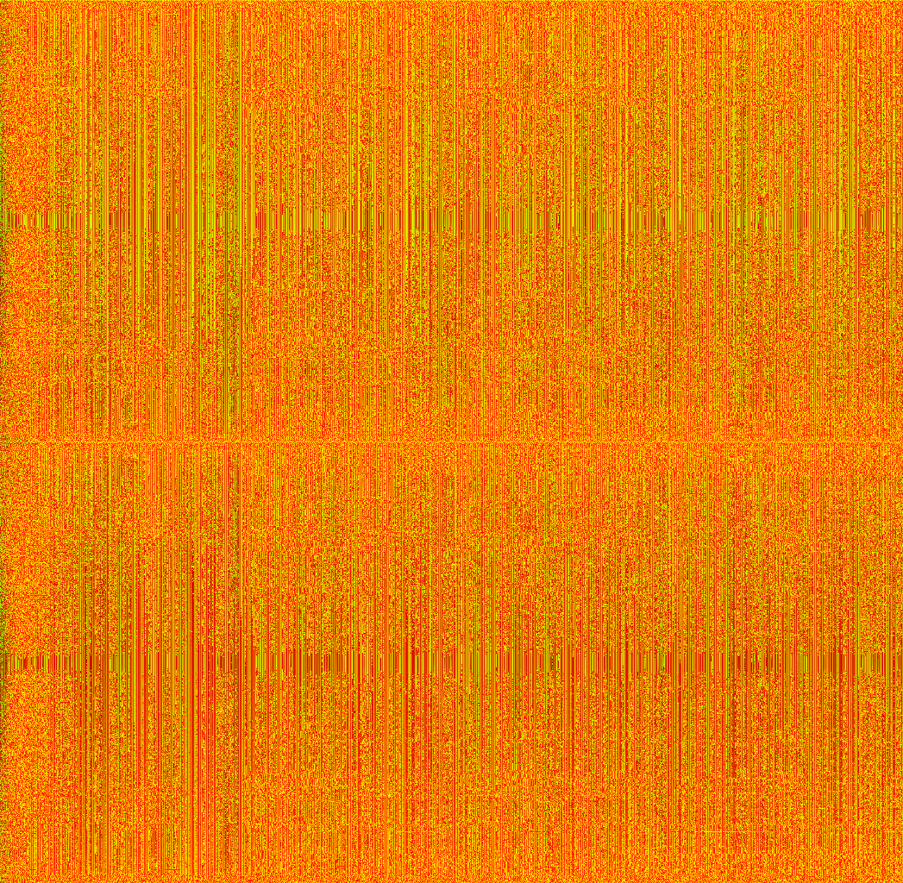
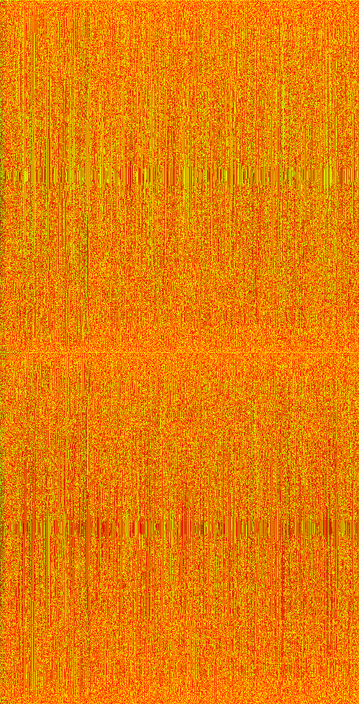

# wavecarve

# This is a work in progress!

A package for reading, writing and manipulating `.wav` files, generating spectrograms and seam carving spectrograms.

This can be used for seam carving, but for audio.

## Images

Before carving

Before carving, including phase

After carving

After carving, including phase

Build with `go build -mod=vendor`.

gpt4 was used as an assistant for this project.

## The next step is to be able to convert the spectrogram back into audio and check what it sounds like.

Currently, cmd/main/main appears to hang when writing output.wav, but it might just be a really slow process.
